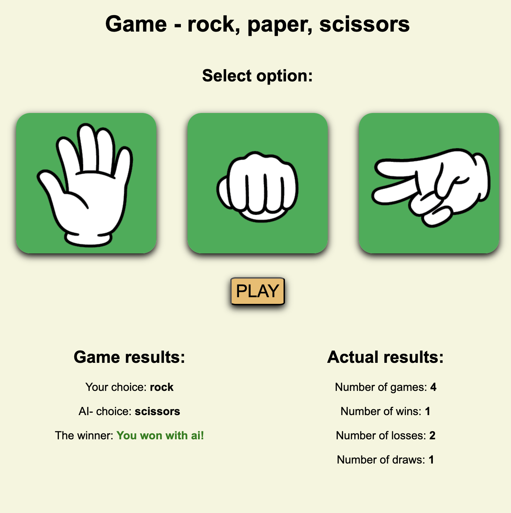

# Game - rock, paper, scissors

This is a known game - rock, paper, scissors built with JavaScript and CSS. The game allows the user to select one of three options (rock, paper, or scissors) by clicking on a corresponding image. Meanwhile, the computer randomly selects one of the three options. All results (game results and actual results) are shown below "PLAY" button.

The game is lightweight, fun, and provides a great example of combining JavaScript for interactivity with CSS for styling.

